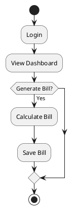
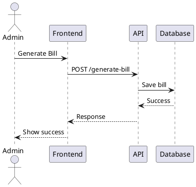
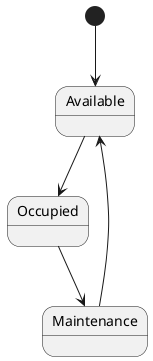
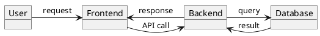
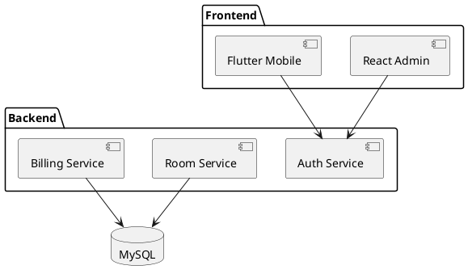
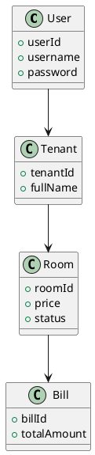
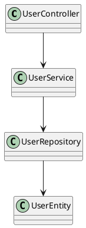

# Diagrams

## Activity Diagram

## Interaction Diagram

## State Diagram

## Integrated Communication Diagram

## System High-Level Design

### Components
- Web Admin
- Mobile App
- REST API
- Authentication Service
- Billing Service
- Database

## Component Diagram

## Class Diagram

## Map Architecture

### Mapping

Frontend Layer
- ReactJS
- Flutter

Backend Layer
- Spring Boot
- Security
- REST API

Data Layer
- MySQL
- JPA

Infrastructure Layer
- Docker
- Nginx
- CI/CD

## Map Class Diagram

