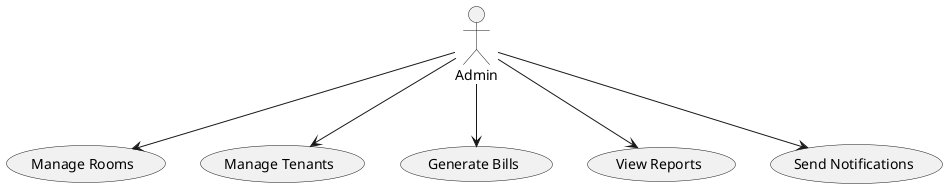
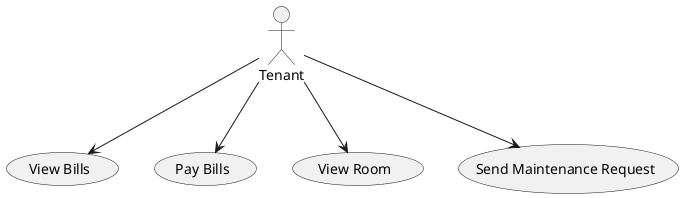

# Use Cases

## Use Case Diagram For Admin

```plantuml
@startuml
actor Admin
Admin --> (Manage Rooms)
Admin --> (Manage Tenants)
Admin --> (Generate Bills)
Admin --> (View Reports)
Admin --> (Send Notifications)
@enduml
```

## Use Case Diagram For Tenant

```plantuml
@startuml
actor Tenant
Tenant --> (View Bills)
Tenant --> (Pay Bills)
Tenant --> (View Room)
Tenant --> (Send Maintenance Request)
@enduml
```
